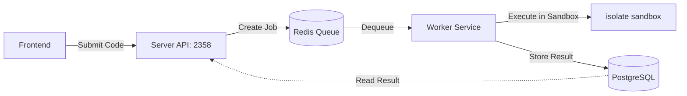

# codeArea-backOffice

Back-office API (Supabase + Node.js + Express). Auth ใช้ระบบเราเอง: JWT + Redis (ไม่ใช้ Supabase Auth).

## 📂 Project Structure

```text
backend/
├── scripts/               # Scripts สำหรับควบคุมระบบ เช่น executor management
├── src/
│   ├── controllers/       # ส่วนควบคุม Logic (Auth, Questions, Submissions, Users, etc.)
│   ├── middlewares/       # Middlewares (authMiddleware, error-handler)
│   ├── models/            # โครงสร้างตารางและโมเดลข้อมูล (Prisma)
│   ├── routes/            # การกำหนด API Endpoints (questions.js, auth.js, etc.)
│   ├── utils/             # ฟังก์ชันช่วยเหลือทั่วไป (Common utilities)
│   │   └── executor/judge0 # ระบบรันโค้ด Judge0 (Docker, .env, README, config)
│   ├── app.js             # การตั้งค่าหลักของ Express application
│   └── server.js          # จุดเริ่มต้นการรัน API (Entry point)
├── supabase/
│   └── migrations/        # SQL สำหรับสร้างโครงสร้างฐานข้อมูล (PostgreSQL migrations)
├── .env.example           # ไฟล์ต้นแบบสำหรับ Environment Variables
└── package.json           # การจัดการ Library และ NPM Scripts
```

## 🛠️ Setup

1. Copy `.env.example` to `.env` แล้วตั้งค่าให้ครบ
2. รัน Redis (เช่น `redis-server` หรือ Docker)
3. `npm install`
4. รัน Supabase migrations (ดูด้านล่าง)
5. `npm run dev` หรือ `npm start`

## .env ที่ต้องมี

- **Supabase:** `SUPABASE_URL`, `SUPABASE_ANON_KEY`, `SUPABASE_SERVICE_ROLE_KEY` (สำหรับ bypass RLS)
- **Auth:** `JWT_SECRET` (อย่างน้อย 32 ตัวอักษร), `JWT_EXPIRES_IN` (เช่น `7d`, `24h`), `REDIS_URL` (เช่น `redis://localhost:6379`)

## Supabase migrations

- อยู่ใน `supabase/migrations/`
- รันตามลำดับใน SQL Editor ของ Supabase Dashboard หรือใช้ `supabase db push`
- หลัง schema ต้นทางแล้วต้องรัน `20250306120000_custom_auth_email_password.sql` เพื่อเพิ่ม `email`, `password_hash` ใน `users`

## Auth (login / register) — JWT + Redis

- **Register:** hash password (bcrypt) → เก็บใน `public.users` (email, password_hash) → ออก JWT → เก็บ token ใน Redis (key = jti, TTL = หมดอายุเท่า JWT)
- **Login:** ตรวจ password → ออก JWT → เก็บใน Redis
- **Logout:** ลบ token ออกจาก Redis
- **Me:** ตรวจ JWT + ดูว่า jti ยังอยู่ใน Redis หรือไม่

Endpoints:

- `POST /api/auth/register` — body: `email`, `password` (อย่างน้อย 6 ตัว), `display_name?`, `role_id?` (รองรับ JSON และ form-data)
- `POST /api/auth/login` — body: `email`, `password`
- `POST /api/auth/logout` — header: `Authorization: Bearer <token>`
- `GET /api/auth/me` — header: `Authorization: Bearer <token>`

Response หลัง login/register: `{ token, expires_in, user: { id, email, display_name, role_id } }`

ใช้ middleware `requireAuth` สำหรับ route ที่ต้องล็อกอิน (จะได้ `req.user`)

## 🚀 Judge0 Setup (Code Executor)


ระบบรันโค้ดและ Sandbox (isolate) โดยใช้ **[Judge0 1.13.1](https://github.com/judge0/judge0/releases/tag/v1.13.1-extra)** สำหรับการประมวลผลโค้ดที่ผู้ใช้ส่งมาจากหน้าบ้าน

### 🛠️ Requirements
| Requirement | Badge | Description |
| :--- | :--- | :--- |
| **Docker** |  | 🐳 **Docker Desktop** (version 20.10+) |
| **Node.js** |  | 🟢 สำหรับรันตัวจัดการบริการ (Npm scripts) |
| **Shell** |  | 🐚 **Bash** (สำหรับจัดการผ่านสคริปต์) |

---

### 📖 Setup Guide
คุณสามารถจัดการบริการรันโค้ดได้โดยตรงจากโฟลเดอร์ `backend` (root) ผ่านคำสั่ง `npm`:

1.  **Initialize Config (ครั้งแรกเท่านั้น)**:
    ```bash
    npm run executor:setup
    ```
    *(คำสั่งนี้จะสร้าง `.env` และ `judge0.conf` ให้อัตโนมัติจากไฟล์ตัวอย่าง)*
    *ระยะเวลาโดยประมาณ 60-70 วินาทีในการสร้าง*

2.  **Start Services**:
    ```bash
    npm run executor:up
    ```

3.  **Check Status**:
    ```bash
    npm run executor:status
    ```
    *(ตรวจสอบการทำงานได้ที่: http://localhost:2358/languages)*

4.  **Command lists**:
    - `npm run executor:logs`: ดู Log การทำงานของทุกบริการ
    - `npm run executor:down`: หยุดการทำงานและลบ Container
    - `npm run executor:restart`: รีสตาร์ทบริการทั้งหมด
    - `docker compose -f src/utils/executor/judge0/docker-compose.yml up -d --build --force-recreate`: manually run (รันใน root directory)

---

### 🏗️ How it Works & Current Services
Judge0 ทำงานร่วมกัน 4 บริการหลักผ่าน Docker ดังนี้:

| Service | Port | Description |
| :--- | :--- | :--- |
| **Server** | `2358` | REST API สำหรับรับส่งข้อมูลการรันโค้ด |
| **Worker** | - | หน่วยประมวลผลอิสระที่รันโค้ดใน Sandbox (`isolate`) |
| **DB (PostgreSQL 13)** | `5432` | ฐานข้อมูลเก็บสถานะและประวัติการส่งโค้ด |
| **Redis 6.0** | `6379` | ระบบคิวงาน (Job Queue) ระหว่าง Server และ Worker |



---

### 💻 Support: Apple Silicon
ระบบได้รับการปรับปรุงให้รองรับชิปตระกูล M-series:
- **Native ARM64 (Default)**: ระบบถูกตั้งค่าเป็นค่าเริ่มต้นสำหรับการรันแบบ Native เพื่อประสิทธิภาพสูงสุดบน Apple Silicon
- ~~**Rosetta 2 Mode**~~: ไม่แนะนำให้ใช้งานและอาจไม่ได้รับการสนับสนุนเนื่องจากระบบเปลี่ยนผ่านสู่ Native ทั้งหมดแล้ว (Deprecated)

---

### 🔍 Troubleshooting
พบปัญหาการทำงาน? ลองตรวจสอบตามหมวดหมู่เหล่านี้:

#### 1. ⚙️ Configuration Errors
- **DB Connection Failed**: ตรวจสอบค่า `POSTGRES_PASSWORD` ใน `.env` และ `judge0.conf` ต้องตรงกัน
- **CORS Errors**: หาก Frontend เรียก API ไม่ได้ ให้เช็ค `ALLOW_CORS=true` ใน `judge0.conf`

#### 2. 🍎 Platform Issues (Apple Silicon / ARM64)
- **Runtime Error (NZEC) on Node.js / TypeScript**: **[Known Issue]** Node.js 12+ requires cgroup v1 features for threading that are missing or incompatible on modern ARM kernels (Docker Desktop on macOS).
  - **Symptoms**:
    - **JavaScript**: `Runtime Error (NZEC)` with stderr containing `Assertion 'uv_thread_create' failed`.
    - **TypeScript**: `Compilation Error` with `Compilation time limit exceeded` (due to `tsc` failing to start threads).
  - **Status**: Currently unsupported for Node.js/TypeScript in this sandbox version.
  - **Alternative**: Use **Python 3** (ID 71) or **C++** (ID 54/76) which are fully supported and tested on Apple Silicon with `CGROUP_MANAGEMENT=false`.
- **Internal Error**: ตรวจสอบว่าใน `docker-compose.yml` มีการตั้งค่า `privileged: true` และ mount `/sys/fs/cgroup` เรียบร้อยแล้ว

#### 3. 🚦 Runtime Issues
- **TypeScript Error**: เราติดตั้ง `typescript@3.7.4` เพื่อความเข้ากันได้กับ Node.js 12. หากต้องการฟีเจอร์ใหม่ๆ อาจต้องปรับปรุง `Dockerfile`
- **Max Processes/Threads**: หากโปรแกรมที่รันมีการใช้ Thread จำนวนมาก ให้ปรับเพิ่ม `MAX_MAX_PROCESSES_AND_OR_THREADS` ใน `judge0.conf`
---

