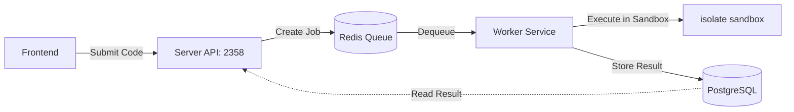

# Judge0 Code Executor (Alternative)

This directory contains the setup for the Judge0 code execution engine. It's used to provide a REST API for executing code in a sandbox.

## 📂 Structure

- `docker/`: Contains the `Dockerfile` for the Judge0 server and worker.
- `docker-compose.yml`: Docker Compose configuration for the entire stack (Server, Worker, DB, Redis).
- `judge0.conf`: Configuration file for Judge0.
- `.env`: Environment variables for the database.

## 🚀 Judge0 Setup

คุณสามารถจัดการบริการรันโค้ดได้โดยตรงจากโฟลเดอร์ `backend` (root) ผ่านคำสั่ง `npm`:

1.  **Initialize Config (ครั้งแรกเท่านั้น)**:
    ```bash
    npm run executor:setup -- --executor=judge0
    ```
    *(คำสั่งนี้จะสร้าง `.env` และ `judge0.conf` ให้อัตโนมัติจากไฟล์ตัวอย่าง)*

2.  **Start Services**:
    ```bash
    npm run executor:up -- --executor=judge0
    ```

3.  **Check Status**:
    ```bash
    npm run executor:status -- --executor=judge0
    ```
    *(ตรวจสอบการทำงานได้ที่: http://localhost:2358/languages)*

4.  **Command lists**:
    - `npm run executor:logs -- --executor=judge0`: ดู Log การทำงานของทุกบริการ
    - `npm run executor:down -- --executor=judge0`: หยุดการทำงานและลบ Container
    - `npm run executor:restart -- --executor=judge0`: รีสตาร์ทบริการทั้งหมด

### 🏗️ How it Works & Current Services
Judge0 ทำงานร่วมกัน 4 บริการหลักผ่าน Docker ดังนี้:

| Service | Port | Description |
| :--- | :--- | :--- |
| **Server** | `2358` | REST API สำหรับรับส่งข้อมูลการรันโค้ด |
| **Worker** | - | หน่วยประมวลผลอิสระที่รันโค้ดใน Sandbox (`isolate`) |
| **DB (PostgreSQL 13)** | `5432` | ฐานข้อมูลเก็บสถานะและประวัติการส่งโค้ด |
| **Redis 6.0** | `6379` | ระบบคิวงาน (Job Queue) ระหว่าง Server และ Worker |



## 🍎 Apple Silicon & ARM Compatibility

If you are developing on an ARM-based machine (e.g., Apple M1/M2/M3), you must configure Docker to use **cgroup v1** for full support (especially for Node.js/TypeScript).

### 1. Enable cgroup v1 in Docker Desktop
The current version of Judge0 (1.13.1) relies on `isolate` with cgroup v1 features that are missing in cgroup v2 (default on modern Docker Desktop for macOS).

1.  Open Docker Desktop settings file (JSON) with your favorite editor (e.g., `vim`):
    - Path: `~/Library/Group Containers/group.com.docker/settings-store.json`
    ```bash
    vim "$HOME/Library/Group Containers/group.com.docker/settings-store.json"
    ```
    *(If `vim` shows `[New]`, you might have the old file name `settings.json` instead)*
2.  Find and modify/add the following key to `true`:
    ```json
    "DeprecatedCgroupv1": true
    ```
3.  **Restart Docker Desktop** to apply changes.

### 2. Verify cgroup version
You can check if Docker is using cgroup v1 or v2 with this command:
```bash
docker info | grep -i cgroup
```
- If you see `Cgroup Version: 2`, it's **cgroup v2** (Default).
- If you see `Cgroup Version: 1`, it's **cgroup v1** (Required).

### 3. Bash script for editing settings-store.json (macOS)
```bash
SETTINGS_FILE="$HOME/Library/Group Containers/group.com.docker/settings-store.json"
# Use settings.json if settings-store.json doesn't exist
[ ! -f "$SETTINGS_FILE" ] && SETTINGS_FILE="$HOME/Library/Group Containers/group.com.docker/settings.json"

if [ -f "$SETTINGS_FILE" ]; then
  # Use sed to change or add the DeprecatedCgroupv1 key (case-sensitive in some versions)
  if grep -q "deprecatedCgroupv1" "$SETTINGS_FILE" || grep -q "DeprecatedCgroupv1" "$SETTINGS_FILE"; then
    sed -i '' 's/"deprecatedCgroupv1": false/"deprecatedCgroupv1": true/g' "$SETTINGS_FILE"
    sed -i '' 's/"DeprecatedCgroupv1": false/"DeprecatedCgroupv1": true/g' "$SETTINGS_FILE"
  else
    sed -i '' 's/{/{\n  "DeprecatedCgroupv1": true,/' "$SETTINGS_FILE"
  fi
  echo "Successfully updated $SETTINGS_FILE. Please restart Docker Desktop."
else
  echo "Settings file not found at $SETTINGS_FILE"
fi
```

### 4. Compatibility Status
- **Python 3 and C++ (Clang/GCC)**: Fully supported and optimized for ARM.
- **Node.js and TypeScript**: Supported **ONLY** if cgroup v1 is enabled. 
  - Without cgroup v1, you will get `Runtime Error (NZEC)` or `Compilation Error`.

### 🔍 Troubleshooting
พบปัญหาการทำงาน? ลองตรวจสอบตามหมวดหมู่เหล่านี้:

#### 1. ⚙️ Configuration Errors
- **DB Connection Failed**: ตรวจสอบค่า `POSTGRES_PASSWORD` ใน `.env` และ `judge0.conf` ต้องตรงกัน
- **CORS Errors**: หาก Frontend เรียก API ไม่ได้ ให้เช็ค `ALLOW_CORS=true` ใน `judge0.conf`

#### 2. 🍎 Platform Issues (Apple Silicon / ARM64)
- **Runtime Error (NZEC) on Node.js / TypeScript**: Node.js 12+ requires cgroup v1 features for threading.
  - **Symptoms**:
    - **JavaScript**: `Runtime Error (NZEC)` with stderr containing `Assertion 'uv_thread_create' failed`.
    - **TypeScript**: `Compilation Error` with `Compilation time limit exceeded` (due to `tsc` failing to start threads).
  - **Solution**: Follow the "Enable cgroup v1" instructions above.
  - **Alternative**: Use Piston executor if you don't want to change Docker settings, or use **Python 3** (ID 71) or **C++** (ID 54/76) which are more stable on ARM.
- **Internal Error**: ตรวจสอบว่าใน `docker-compose.yml` มีการตั้งค่า `privileged: true` และ mount `/sys/fs/cgroup` เรียบร้อยแล้ว

#### 3. 🚦 Runtime Issues
- **TypeScript Error**: เราติดตั้ง `typescript@3.7.4` เพื่อความเข้ากันได้กับ Node.js 12. หากต้องการฟีเจอร์ใหม่ๆ อาจต้องปรับปรุง `Dockerfile`
- **Max Processes/Threads**: หากโปรแกรมที่รันมีการใช้ Thread จำนวนมาก ให้ปรับเพิ่ม `MAX_MAX_PROCESSES_AND_OR_THREADS` ใน `judge0.conf`

For more details on management, use the `scripts/executor.sh` in the project root.
